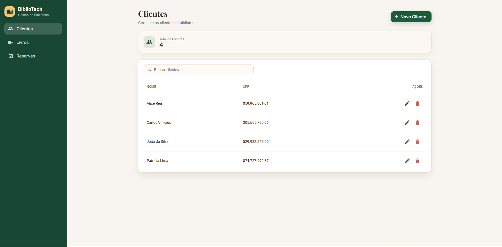

# Sistema de Biblioteca - Front-end Angular



Sistema completo de gerenciamento de biblioteca desenvolvido com **Angular 21**.

## 🚀 Funcionalidades

### Módulo de Clientes
- Listagem de clientes 
- Busca por nome ou CPF
- Criar e editar clientes
- Validação matemática de CPF
- Máscara automática de CPF (XXX.XXX.XXX-XX)
- Confirmação antes de excluir
- Tratamento de CPF duplicado

### Módulo de Livros
- Listagem em cards responsivos
- Filtros: Todos / Disponíveis / Reservados
- Badge visual de status (disponível/reservado)
- Criar e editar livros
- Bloqueio de exclusão para livros reservados
- Campo "disponível" controlado automaticamente

### Módulo de Reservas
- Listagem com abas: Total / Ativas / Em Atraso / Devolvidas
- Criar nova reserva
- Devolver livro com cálculo automático de multa
- Fórmula de multa exibida: R$ 10,00 + (R$ 10,00 × 5% × dias)

## 📦 Tecnologias Utilizadas

- **Angular 21** (Standalone Components)
- **Angular Material 21** (Componentes sem tema pré-definido)
- **RxJS** para gerenciamento de estado
- **TypeScript 5.9**
- **SCSS** para estilização customizada
- **Reactive Forms** com validações

## 🔧 Instalação

### Pré-requisitos
- Node.js 18+ e npm
- Angular CLI (`npm install -g @angular/cli`)
- Backend NestJS rodando em `http://localhost:3000`

### Passos

1. **Clone o repositório ou navegue até a pasta do projeto**
```bash
cd c:\Users\Administrador\Desktop\Desafio\front-end
```

2. **Instale as dependências**
```bash
npm install
```

3. **Configure o backend**
Certifique-se de que o backend NestJS está rodando em `http://localhost:3000` com CORS habilitado.

4. **Execute a aplicação**
```bash
npm start
```

5. **Acesse no navegador**
```
http://localhost:4200
```

## 📂 Estrutura do Projeto

```
src/
├── app/
│   ├── core/
│   │   ├── models/               # Interfaces e DTOs
│   │   ├── services/             # Services HTTP
│   │   └── interceptors/         # Interceptor de erros
│   │
│   ├── shared/
│   │   ├── components/           # Componentes compartilhados
│   │   ├── pipes/                # Pipes (CPF, Date)
│   │   ├── directives/           # Diretivas (CPF Mask)
│   │   └── validators/           # Validadores customizados
│   │
│   ├── features/
│   │   ├── clientes/            # Módulo de clientes
│   │   ├── livros/              # Módulo de livros
│   │   └── reservas/            # Módulo de reservas
│   │
│   ├── layout/                  # Header, Footer
│   ├── app.routes.ts            # Rotas principais
│   └── app.config.ts            # Configuração global
│
└── environments/                # Configurações de ambiente
```

## 🎨 Design e UX

### Paleta de Cores Personalizada
- **Brand (Primary):** Verde escuro (#1f5a3a)
- **Accent:** Dourado (#f2c66d)
- **Danger:** Vermelho suave (#d95c54)
- **Background:** Bege claro (#f8f4ef)
- **Text Primary:** Preto suave (#2d2a26)
- **Text Muted:** Marrom claro (#7b7166)

### Fontes
- **Sans-serif:** Inter (interface geral)
- **Serif:** Playfair Display (títulos e destaques)

### Responsividade
- **Desktop:** Grid de 3 colunas, tabelas completas
- **Tablet:** Grid de 2 colunas
- **Mobile:** Grid de 1 coluna, menu colapsável

## 🔑 Funcionalidades Chave

### Validação de CPF
```typescript
// Validação matemática completa dos dígitos verificadores
// Rejeita CPFs com todos os dígitos iguais
// Formatação automática: XXX.XXX.XXX-XX
```

### Cálculo de Multa
```typescript
// Fórmula: R$ 10,00 + (R$ 10,00 × 5% × dias de atraso)
// Exemplo: 4 dias de atraso = R$ 12,00
// Dias arredondados para cima (ceil)
```

### Tratamento de Erros
- Interceptor HTTP global
- Mensagens amigáveis via Snackbar
- Status 400, 404, 409, 0 tratados

## 📝 API Endpoints Consumidos

### Clientes
- `GET /clientes` - Listar todos
- `GET /clientes/:id` - Buscar por ID
- `POST /clientes` - Criar
- `PATCH /clientes/:id` - Atualizar
- `DELETE /clientes/:id` - Remover

### Livros
- `GET /livros` - Listar todos
- `GET /livros?disponivel=true` - Filtrar por disponibilidade
- `GET /livros/:id` - Buscar por ID
- `POST /livros` - Criar
- `PATCH /livros/:id` - Atualizar
- `DELETE /livros/:id` - Remover

### Reservas
- `GET /reservas` - Listar todas
- `GET /reservas/em-atraso` - Listar em atraso
- `GET /reservas/cliente/:clienteId` - Por cliente
- `GET /reservas/:id` - Buscar por ID
- `POST /reservas` - Criar
- `PATCH /reservas/:id/devolver` - Devolver

---

**Certifique-se de que o backend está rodando antes de usar a aplicação!**
